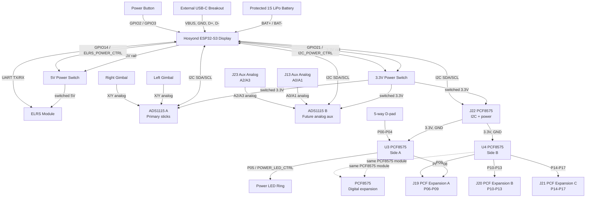

# Hosyond Carrier Board Block Diagram

This carrier board is intended to replace loose wiring with a clean plug-in harness.
It should mostly route signals between prebuilt modules instead of recreating tiny
IC circuits on the PCB.

## System Diagram

## Main Design Rules

- Keep the power button on direct Hosyond GPIO pins `GPIO2` and `GPIO3` so it can wake the ESP32 from deep sleep.
- Use `GPIO14` to control the switched `5V` rail for the ELRS module.
- Use `GPIO21` to control the switched `3.3V` rail for I2C modules and the D-pad.
- Keep all grounds common.
- Switch the positive power rails, not ground.
- Do not connect USB `VBUS` directly to the LiPo battery.
- Do not connect the LiPo battery directly to the `5V` rail.
- Add test pads for `5V`, `3.3V`, `GND`, `SDA`, `SCL`, `UART_TX`, and `UART_RX`.

## I2C Power Caution

If the `3.3V` rail to the I2C modules is switched off while `SDA` and `SCL` remain
connected, some modules can be partially powered through the I2C lines. The best
fix is to use an I2C power switch/bus-isolation board or add proper bus isolation
in the final PCB design.

## Files

- Detailed net table: `Hosyond_carrier_net_table.csv`
