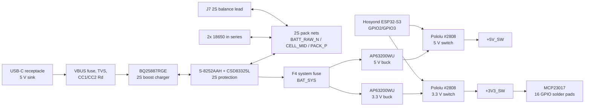

# USB-C 2S LiPo / 2x18650 Power Board Design

## Goal

Small KiCad board that accepts 5 V from USB-C, charges a 2S Li-ion/LiPo pack, and generates switched 5 V and 3.3 V rails for external devices controlled by the Hosyond ESP32-S3 display board.

The battery source is now selectable by population/use:

- External 2S LiPo pack through `J7`, a 3-pin JST-XH style balance connector: `B-`, `CELL_MID`, `B+`.
- Two installed 18650 cells in series through `BT1` and `BT2`.

Use either the external 2S pack on `J7` or installed 18650 cells, not both at the same time.

## Architecture

## Main Components

| Function | Rev-A part | Notes |
|---|---|---|
| USB-C 5 V sink | USB-C receptacle plus 5.1 kOhm CC pulldowns | Power-only Type-C input, no USB-PD. |
| 2S charger | TI `BQ25887RGE` | 5 V boost-mode charger for 2-cell Li-ion/LiPo packs with midpoint/balance connection. |
| 2S protection | ABLIC `S-8252AAH-M6T1U` + TI `CSD83325L` | Standalone 2S OV/UV/overcurrent/short protection using back-to-back low-side FETs. |
| 5 V regulator | Diodes Inc. `AP63200WU` | 2S-to-5 V buck, target load 1 A max. |
| 3.3 V regulator | Diodes Inc. `AP63200WU` | 2S-to-3.3 V buck, target load 500 mA max. |
| Rail switches | Pololu #2808 modules | Switches are after the regulators; ESP32 GPIO2 controls 5 V, GPIO3 controls 3.3 V. |
| Analog inputs | 2x TI `ADS1115IDGS` | Powered from `+3V3_SW`, so ADCs and connected 3.3 V sensors shut down with the switched rail. |
| GPIO expander | Microchip `MCP23017-E/SO` | 16-bit I2C GPIO expander powered from `+3V3_SW`; default address `0x20`. |

## Battery Nets

- `BATT_RAW_N`: raw 2S pack negative / lower cell negative.
- `GND`: protected board/load/charger negative after the low-side protection FETs.
- `CELL_MID`: lower cell positive and upper cell negative.
- `PACK_P`: upper cell positive / 2S pack positive.
- `BAT_SYS`: fused 2S system bus feeding both buck regulators.

The two 18650 holders are now series-connected:

- `BT1`: lower cell, negative to `BATT_RAW_N`, positive through `F2` to `CELL_MID`.
- `BT2`: upper cell, negative to `CELL_MID`, positive through `F3` to `PACK_P`.
- `J7`: external 2S balance input, pin 1 `BATT_RAW_N`, pin 2 `CELL_MID`, pin 3 `PACK_P`.

## 2S Protection

The old single-cell `BQ297xy` protection IC is not valid for a 2S pack. The active schematic now uses an ABLIC `S-8252AAH-M6T1U` 2S protection IC and the existing TI `CSD83325L` dual common-drain N-FET as the low-side back-to-back protection switch.

The selected `S-8252AAH-M6T1U` variant has these rev-A thresholds from the ABLIC datasheet selection table:

- Overcharge detection: 4.250 V per cell.
- Overcharge release: 4.100 V per cell.
- Overdischarge detection/release: 3.000 V per cell.
- Discharge overcurrent detection: 0.200 V at `VM`.
- Load short-circuit detection: 0.500 V at `VM`.
- Charge overcurrent detection: -0.200 V at `VM`.
- 0 V battery charge: enabled.

Rev-A support parts follow the datasheet connection example:

- `R14`, `R15`: 470 ohm sense/filter resistors on `VDD` and `VC`.
- `C25`, `C26`: 100 nF cell sense capacitors.
- `R16`: 2.0 kOhm from `VM_SENSE` to protected `GND`.
- `Q1`: CSD83325L back-to-back low-side FET pair between `BATT_RAW_N` and protected `GND`.

The CSD83325L is retained from the previous design, but its 12 V rating should be reviewed during PCB release because a full 2S pack is 8.4 V and real products see transients. A 20 V or 30 V FET pair would give more margin if board area allows.

The protector does not set the normal charge current. The BQ25887 charger should be configured so USB-C charging is firmware-limited from 500 mA minimum up to 1.5 A maximum, with the hardware input-current limit also held at or below 1.5 A.

## Regulator Population

The 1S boost/buck-boost regulators were replaced because a 2S pack ranges roughly from discharged to 8.4 V full charge.

- `U3`: `AP63200WU` configured for 5 V with `R8 = 523 kOhm` and `R9 = 100 kOhm`.
- `U4`: `AP63200WU` configured for 3.3 V with `R11 = 316 kOhm` and `R12 = 100 kOhm`.
- `L1` and `L2`: 4.7 uH shielded inductors.
- Input capacitors on `BAT_SYS` are rated 16 V.
- Output capacitors are rated at least 10 V.

## Switched Outputs And Signals

- `SW1` Pololu #2808: `+5V` in, `+5V_SW` out, control through `CTRL_5V_SW` from ESP32 `GPIO2`.
- `SW2` Pololu #2808: `+3V3` in, `+3V3_SW` out, control through `CTRL_3V3_SW` from ESP32 `GPIO3`.
- `J4`: 5-pin 1.25 mm JST UART header with `+5V_SW`, GND, TX, RX, GND.
- `J5`: 4-pin 2.54 mm I2C header with `+3V3_SW`, GND, SDA, SCL.
- `J6`: 2-pin deep-sleep pushbutton header between `GPIO14` and `GPIO21`.
- `J3x`: individual solder pads for the Hosyond board wires.

## MCP23017 GPIO Expander

The daughterboard now includes `U7`, a Microchip `MCP23017-E/SO` 16-bit I2C GPIO expander in SOIC-28W.

- `VDD`: `+3V3_SW`, so the expander shuts down with the switched 3.3 V rail.
- `VSS`: protected `GND`.
- `SDA` / `SCL`: shared `I2C_SDA` / `I2C_SCL` bus with the ADS1115s.
- Address pins `A0`, `A1`, and `A2`: default 0 ohm straps to GND, giving address `0x20`.
- `RESET`: 10 kOhm pullup to `+3V3_SW` and 100 nF reset capacitor to GND.
- `INTA` / `INTB`: 10 kOhm pullups to `+3V3_SW` and individual solder pads.
- GPIO outputs: `GPA0..GPA7` and `GPB0..GPB7` each pass through a 100 ohm series resistor to an individual solder pad.
- ESD placeholders: four 4-channel 3.3 V TVS/ESD arrays protect the external pad side of the 16 GPIO lines.
- `GPA7` and `GPB7`: treat as output-only unless the exact MCP23017 variant/revision is verified for input use.

Because the MCP23017 is powered from `+3V3_SW`, firmware should enable the 3.3 V switched rail before using the I2C bus for the expander. The ADS1115 pullups are also on `+3V3_SW`, so the switched 3.3 V rail is the intended I2C pullup source for the daughterboard devices.

## Generated Files

- `Daughterboard.kicad_sch`: generated pin-level schematic.
- `Daughterboard.kicad_sym`: project-local symbols.
- `Daughterboard_pinlevel_bom.csv`: generated BOM with purchase-link column.
- `Daughterboard_pcb_bom.csv`, `pcb_component_schedule.csv`, `starter_bom_and_nets.csv`, and `starter_bom_and_nets_with_links.csv`: synced BOM copies.
- `Daughterboard_pinlevel.pdf` and `Daughterboard_pinlevel_preview.png`: exported schematic preview.
- `Daughterboard_pinlevel_erc.rpt`: KiCad ERC report.

## Footprint Policy

The design is space-constrained, so rev-A uses SMD footprints for nearly all normal components:

- Fuses/PTCs: 1206 SMD fuse footprints.
- NTC: 0603 SMD thermistor footprint.
- Buck/charger inductors: compact shielded SMD inductor footprints.
- Resistors/capacitors: 0603/0805 SMD as listed in the BOM.
- Hosyond and MCP23017 wire breakouts: flat 1.5 mm SMD test pads.
- ICs, ESD arrays, FETs, charger, regulators, ADCs, and MCP23017: SMD packages.

The intentional exceptions are mechanical/interface parts: USB-C, 18650 holders, Pololu switch modules, JST connectors, and 2.54 mm pin headers. Those connector styles were left unchanged.

## Sources

- TI BQ25887 product/datasheet: https://www.ti.com/product/BQ25887
- ABLIC S-8252 Series datasheet: https://www.ablic.com/en/doc/datasheet/battery_protection/S8252_E.pdf
- TI CSD83325L product/datasheet: https://www.ti.com/product/CSD83325L
- Diodes Inc. AP63200/AP63201/AP63203/AP63205 datasheet: https://www.diodes.com/assets/Datasheets/AP63200-AP63201-AP63203-AP63205.pdf
- Microchip MCP23017 datasheet: https://ww1.microchip.com/downloads/aemDocuments/documents/APID/ProductDocuments/DataSheets/MCP23017-Data-Sheet-DS20001952.pdf
- Pololu #2808 Mini Pushbutton Power Switch LV: https://www.pololu.com/product/2808
